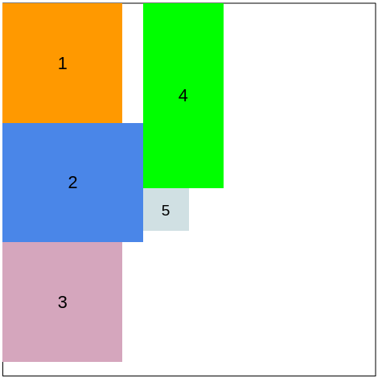

# Fitting Boxes

The challenge here is to provide information about a list of boxes being fit in to a container. This may initially seem similar to the [knapsack problem](https://en.wikipedia.org/wiki/Knapsack_problem); however, it is simplified so that it is actually much easier.

Here is the problem.

> Assume that you have rectangluar container (say 10x10) and are trying to fit other smaller rectangular boxes in this container. You will always pack boxes from top to bottom then move left when the column cannot take the next box. Boxes are always packed in order. Columns are always the widest of whatever box fits in them. If a box can't fit in the container, return the existing list of what fit and ignore the rest.
>
> The result to return is the list of the top-left coordinate for each box in the container.

This problem can be visualized with the following example



Notice that in the example, the column width is the maximum of the widest box packed. There is no overlap horizontally between columns. This is a big hint because it helps imply that this problem isn't really about packing boxes efficiently.

As you'll see in the examples, it is a problem when you can use recursive programming to make a clever looking succinct answer -- a tactic that commonly seems to come up in code interviews.

# Solution: Using Stack-based Recursion

This is a solution that has some caveats, but ended up being what the interviewer wanted to see. Recursion is often
helpful in solving problems, albeit in this case it really wasn't needed and arguably limits the code in a non-obvious
way (stack limits in Python).

Here is some boiler plate code that the problem started with. Nothing much to see here other than the types. It can be
assuemd that box sizes are always positive, non-zero values. No tricks there.

```
from typing import List, Optional

class Point:
    def __init__(self, x: int, y: int):
        self.x: int = x
        self.y: int = y

    def __repr__(self):
        return f'({self.x}, {self.y})'

class Box:
    def __init__(self, width: int, height: int):
        self.width: int = width
        self.height: int = height

def pack_boxes(container: Box, boxes: List[Box]) -> List[Point]:
    raise NotImplementedError()
```

There isn't much to see above. You start with `Box` intances that have a `width` and `height` both being positive
integers. You want to end up with `Point` instances that have an `x` and `y` representing the top-left corner of the
packed box.

Below is a recursive solution that will pack boxes until a terminal state is reached. Notice that an extra method
is defined to lazy-evaluate the points that fit. `pack_boxes` could be converted to a generator.

```
def pack_boxes(container: Box, boxes: List[Box]) -> List[Point]:

    # Define an extra methd to recursively pack and check the terminal condition
    def pack_box(x: int, y: int, max_width: int, boxes: List[Box]) -> Optional[Point]:
        # No boxes left to pack is a terminal state
        if len(boxes) == 0:
            return
        box = boxes[0]
        # Too wide means nothing can be done
        if box.width + x > container.width:
            return
        # Too tall for the container means nothing can be done
        if box.height > container.height:
            return
        # Too tall for remaining space means try to pack the same box again
        if box.height + y > container.height:
            for p in pack_box(x + max_width, 0, 0, boxes):
                yield p
        # Box fits, add it and try next
        else:
            max_width = max(max_width, box.width)
            yield Point(x, y)
            for p in pack_box(x, y + box.height, max(max_width, box.width), boxes[1:]):
                yield p

    # Make an in-memory list, but could convert this entire function to lazy evaluate
    return list(pack_box(0, 0, 0, boxes))
```

Above will generate output that matches the following, if you use the following doctest.

```
# Three boxes that fix in two columns
>>> pack_boxes(Box(10, 10), [Box(1, 5), Box(2, 5), Box(1, 1)])
[(0, 0), (0, 5), (2, 0)]

# Box is too wide
>>> pack_boxes(Box(10, 10), [Box(1, 11)])
[]

# Box is too tall
>>> pack_boxes(Box(10, 10), [Box(11, 1)])
[]

# One box fits and one doesn't
>>> pack_boxes(Box(10, 10), [Box(1, 1), Box(1, 11)])
[(0, 0)]
```

This solution uses stack-backed recursion, which means we'll be limited by the size of the stack or other language
guardrails related to stack safety. In Python, this should mean we can't pack more than 1000 boxes since that is the
default cutoff for methods on the stack. Python doesn't have tail call optimization. Even though calls that are using 
recursion here won't ever do more work, they still count toward the stack limit.

I'd argue that two helpful improvements should be made, if this algorithm was being used in production, potentially with
lots of boxes to pack:

1. Convert the method to use the heap. Don't call `pack_box` recursively. Instead keep similar variables in the method's scope and have a loop over `boxes` that updates the variables accordingly.

2. Have `pack_boxes` be a generator and take a generator for getting `boxes`. That'd allow the code to return `Point` instances as they are calculated. It'd also switch to have max memory usage be tied to buffering all `Box` instances to just boxes needed per column (really `Point` instances calculated per column).

Both of the above likely don't matter for this example case, but they are interesting to discuss since the interviewer may want to know that you can reason about memory usage, know about lazy-evaluation, and also are aware of stack-vs-heap recursion.

Memory usage is simple for this one. It is `O(n)` where `n` is the number of `Box` instances passed in. The array is being sliced when passed to the recursion -- it'll not duplicate all the values in memory. Runtime is similar `O(n)` since we're looping over the list of boxes once.
