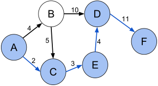
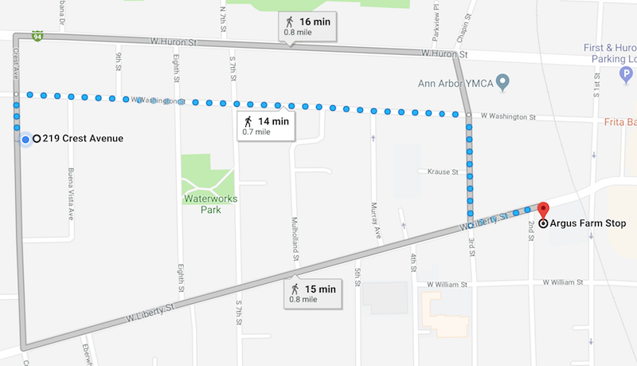

# Shortest Path

A common whiteboard coding problem is to ask about graphs and shortest paths. It
is interesting since the solution requires knowing some common CS theory and one
must reason about time and space complexity based on vertices and edges.

If you can cast a problem as a set of vertices and edges, then consider if 
[shortest path](https://en.wikipedia.org/wiki/Shortest_path_problem) fits and
[Dijkstra's algorithm](https://en.wikipedia.org/wiki/Dijkstra%27s_algorithm) is
a fair solution.

I best remember this problem from interviews with Google and Counsyl. Google
directly asked it as shortest path given a map. Counsyl was a bit more sneaky
and posed it as reassembly of chunks of data from a satellite that were
repeated, varied in length and arrived out of order.

### Example Graph

Here is an example of a weighted, direct graph from Wikipedia made by Artyom
Kalinin [CC BY-SA 3.0](https://creativecommons.org/licenses/by-sa/3.0)



Shortest path (A, C, E, D, F) between vertices A and F in the weighted directed
graph.

This graph can be represented in Python as the following. Each key is a vertex
and the value list notes what other vertices it connects to and the weight.

```python
graph = {
    'A': [('B', 4), ('C', 2)],
    'B': [('C', 5), ('D', 10)],
    'C': [('E', 3)],
    'D': [('F', 11)],
    'E': [('D', 4)],
    'F': [],
}
```

### Example Algorithm

Here is an example of Dijkstra's algorithm in Python for the above graph.

```python
import sys
from heapq import heappush, heappop


def shortest_paths(graph, v_start):
    paths = {}
    queue = [(0, v_start)]
    while queue:
        total_dist, v_dst = heappop(queue)
        for v_nxt, dist in graph[v_dst]:
            _d = total_dist + dist
            if paths.get(v_nxt, (sys.maxsize,))[0] > _d:
                paths[v_nxt] = (_d, v_dst)
                heappush(queue, (_d, v_nxt))
    return paths
```

It'll populate `paths` so that each vertex is a key with a value of the `vertex` 
connected to it that has the shortest path from source.

A neat trick to print the path is to follow `vertices` backwards from the
destination.

```python
def print_path(paths, v_src, v_dst):
    path = [v_dst]
    current = v_dst
    while current != v_src:
        _, _p = paths[current]
        path.append(_p)
        current = _p
    for step in reversed(path):
        print(step)
```

Finally, using the above code on the graph end up printing the solution.

```python
paths = shortest_paths(graph, 'A')
print_path(paths, 'A', 'F')
```

Output is the expected (A, C, E, D, F)

```python
$ python3 shortest_path_example.py 
A
C
E
D
F
```

### Real World Example

Reusing the above algorithms with something more practical is straight-forward.
Map data can be treated as a graph, and it is handy to know what the shortest
route is from your location to a destination.

OpenStreetMap.org provides an XML export. Here is an export for
[Ann Arbor, MI](https://www.openstreetmap.org/export#map=15/42.2758/-83.7501),
and a [code snippet](openstreetmap.py) to convert the XML to a graph similar to
the above example.

The final result is similar to the following. Keys are now intersections of
roads instead of letters such as `'A'`. For example, `('Crest Avenue', 'West Washington Street')`
is a good starting location for someone living in the city. The intersections it
connects to and distances to them are the values.

```python
graph == {
    ('Crest Avenue', 'West Washington Street'): [
        (('Buena Vista Avenue', 'Crest Avenue'), 0.0022786980844370815),
        (('Bemidji Drive', 'Crest Avenue'), 0.0031291820017415183),
        (('Crest Avenue', 'West Huron Street'), 0.0009401537108366264),
...
}
```

Given the above, it can be directly run with the same `shortest_paths` and
`print_path` methods. All you need is a destination. Let's pick local cafes.

```python
# find all paths from your starting location
start = ('Crest Avenue', 'West Washington Street')
paths = shortest_paths(graph, start)

# Argus -- A favorite cafe
print("\nArgus @ ('Second Street', 'West Liberty Street')")
print_path(paths, start, (u'Second Street', u'West Liberty Street'))
```

Output isn't as friendly as a GPS, but it does correctly note a good path from
Crest Ave to Washington to Third then Liberty and finally Argus on Second and Liberty.

```python
Argus @ ('Second Street', 'West Liberty Street')
('Crest Avenue', 'West Washington Street')
('Third Street', 'West Washington Street')
('Third Street', 'West Liberty Street')
('Second Street', 'West Liberty Street')
```

The path seems pretty good! My friend Google agrees and also points out other
less optimal paths that the shortest path algorithm correctly skipped.



